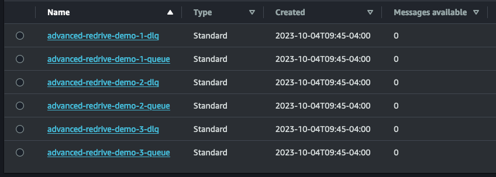
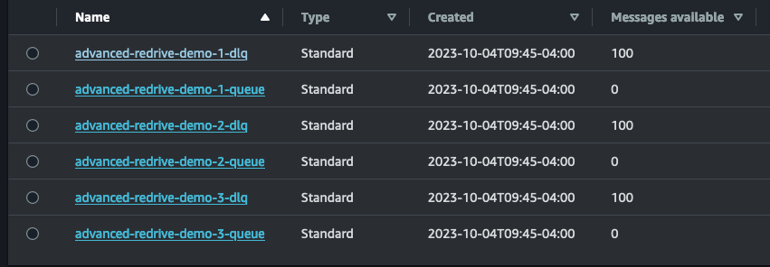
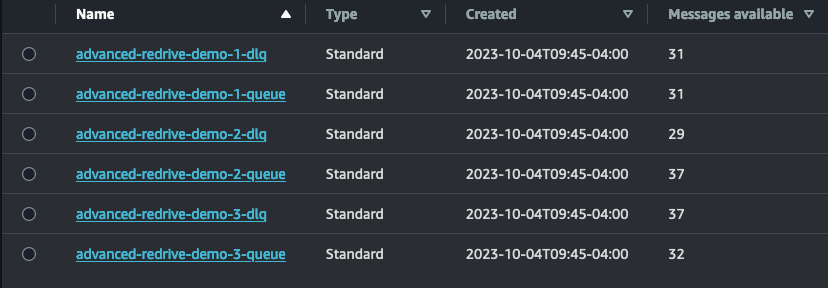

# Analyzing and Correcting Errors with Advanced SQS Redrive

Analyzing dead-letter queues (DLQs) within the AWS ecosystem can be tricky. Receiving and analyzing messages via the AWS Console is very limited, and does not allow for the manipulation of messages in any sensible manner. Sure, you can redrive an entire DLQ, but what if you need to analyze thousands of messages or make changes?

There are many potential solutions to this problem, but a simple solution that I've developed is to download your queues' messages locally where they can be analyzed with any tool of your choosing. I've defined a stateful directory structure to reflect where a message is in its journey of analysis so that you can make changes in whatever manner you deem appropriate.

## Demo Setup

Let's demo what it would look like to use the Advanced Redrive tool by setting up some queues and inserting messages into dead-letter queues, simulating failures.

If you would like to follow along, see our [demo repo](https://github.com/adamtrancurantis/aws-sqs-advanced-redrive-demo).

First, we will use `cdk deploy` to deploy some test queues (tip: use `export AWS_PROFILE=<my profile>` ):



Next, let's insert some test errors:

`npm run insert-fake-data`

Now we should have 100 errors in each `dlq`:



## Setup the Advanced Redrive tool

Our advanced redrive tool can be found here:

https://github.com/curantis-solutions/aws-sqs-advanced-redrive

We copy the sample configs from the demo repo (`./config`) to the redrive tool (`./config`). These files contain the queues and processing instructions:

```
receiveCount: 150
dataDirectory: messages
messageProcessors: message-processors
queueConfigs:
  - source: advanced-redrive-demo-1-dlq
    destination: advanced-redrive-demo-1-queue
    processor: customProcessor
  - source: advanced-redrive-demo-2-dlq
    destination: advanced-redrive-demo-2-queue
    processor: customProcessor
  - source: advanced-redrive-demo-3-dlq
    destination: advanced-redrive-demo-3-queue
    processor: customProcessor
```

## Getting queue information with the Advanced Redrive tool

The advanced redrive tool uses a directory structure to store messages as they are received, processed, updated, and deleted. The first thing we should do is retrieve queue information from the demo config, `./config/demo.yaml`. When we run the following command, the tool builds out the directory structure automatically:

```
➜  npm run redrive -- -c config/demo.yaml -l

> aws-sqs-advanced-redrive@1.0.0 redrive
> ts-node src/app.ts -c config/demo.yaml -l

┌─────────┬─────────────────────────────┬──────────────────────────────────────────────────────────────────┐
│ (index) │ ApproximateNumberOfMessages │                             QueueArn                             │
├─────────┼─────────────────────────────┼──────────────────────────────────────────────────────────────────┤
│    0    │            '100'            │ 'arn:aws:sqs:us-west-2:904442064295:advanced-redrive-demo-1-dlq' │
│    1    │            '100'            │ 'arn:aws:sqs:us-west-2:904442064295:advanced-redrive-demo-2-dlq' │
│    2    │            '100'            │ 'arn:aws:sqs:us-west-2:904442064295:advanced-redrive-demo-3-dlq' │
└─────────┴─────────────────────────────┴──────────────────────────────────────────────────────────────────┘
```

We can see the test messages we've inserted. Our directory structure is also created:

```
➜ tree messages
messages
├── advanced-redrive-demo-1-dlq
│   ├── deletes
│   │   ├── archived
│   │   ├── errors
│   │   └── pending
│   ├── processing-errors
│   ├── received
│   ├── skip
│   └── updates
│       ├── archived
│       ├── errors
│       └── pending
├── advanced-redrive-demo-2-dlq
│   ├── deletes
│   │   ├── archived
│   │   ├── errors
│   │   └── pending
│   ├── processing-errors
│   ├── received
│   ├── skip
│   └── updates
│       ├── archived
│       ├── errors
│       └── pending
└── advanced-redrive-demo-3-dlq
    ├── deletes
    │   ├── archived
    │   ├── errors
    │   └── pending
    ├── processing-errors
    ├── received
    ├── skip
    └── updates
        ├── archived
        ├── errors
        └── pending
```

## Receiving messages from our dead-letter queues

Next, we receive messages with the Advanced Redrive tool:

```
➜  npm run redrive -- -c config/demo.yaml -r

> aws-sqs-advanced-redrive@1.0.0 redrive
> ts-node src/app.ts -c config/demo.yaml -r

Received batch of 10 messages for advanced-redrive-demo-1-dlq.
...
Received total of 100 messages for advanced-redrive-demo-3-dlq.
Received total of 100 messages for advanced-redrive-demo-1-dlq.
Received total of 100 messages for advanced-redrive-demo-2-dlq.
```

Note that the receive count should exceed the number of messages available. This is because SQS does not always return the max batch size of 10.

After we have received messages, we can view them in the DLQ directories:

```
./messages/advanced-redrive-demo-1-dlq/received
./messages/advanced-redrive-demo-2-dlq/received
./messages/advanced-redrive-demo-3-dlq/received
```

Here is one example message. Notice `Body` has been parsed:

```
{
  "MessageId": "0acc2f20-1b9f-4777-a4cd-31391a5072ce",
  "ReceiptHandle": "AQEBM9Vv7YD6+Jgz+SYEsqp+y2aq3pSiV/Ul3QnGjHmc1U2IAxdwrZ8aAZVS0JEYOzUugIPI6MZC95RsUproDyWsRg4q1lbbzMOnrMdwm+YVet8Sl2aCF9k2MpmLC2LvoDieMvmeqbEN/kJxxRhlh44ur4+W/KgsLRcE6a5oMbONjsuq6X0q39v0+Z4neL6YFDd14hJMcuf1Q+qSFjRrp0elja2SDX0dGXMCouU4Sc2Nlo7gQwVH+8K3MaDReQl3KQusYBroG+JOzbiKv70NDpKlUyEXWDN/YC+PV1IUFwJnqHXXfoPz5MzJRbsRs23SxAavamHSGWqx1S51LjYAGFb/7S/FhWKHy207YVs1jW8kCE86NR3QPcAhfDheQrpGuZjLvu89lstwtZtRVKsWUvvKJ3eD8kuIGsToCJ2fhoyLZpM=",
  "MD5OfBody": "94e2ca987533a90d19b04b2878ca054b",
  "Body": {
    "messageType": "SHOULD_DELETE",
    "email": "Brianne.Prohaska71@hotmail.com",
    "description": "Vivo utor adversus aperte cornu conor cito decumbo."
  },
  "Attributes": {
    "SentTimestamp": "1696447591720"
  }
}
```

## Processing messages from our dead-letter queues

The Advanced Redrive tool comes with a built-in processor, but since we are dealing with files, you can do this step with tooling of your own.

At this point, you can take any individual message and move it into:

- `./messages/<queue_name>/updates/pending` - Will send the message to the destination queue. You can modify the message beforehand using any method of your choosing.
- `./messages/<queue_name>/deletes/pending` - Will delete the message from the source queue.
- `./messages/<queue_name>/skips` - Will do nothing with the message.

You can also use our TypeScript-based processor tooling if you wish:

`createMessageReducer(shouldSkip: TruthyFunction, shouldDelete: TruthyFunction, updateMapper: UpdateMapper): MessageProcessorReducer`

`shouldSkip` and `shouldDelete` take the message as their only argument and move the file into their appropriate directory if their function returns `true`. The `updateMapper` allows you to make in-place modifications to the message before moving it into the `updates/pending` directory.

## Separating our messages based on its issue

Our test errors come in three flavors. `messageType` can be `SHOULD_SKIP`, `SHOULD_DELETE`, or `SHOULD_MODIFY`. Here is a custom processor to separate our messages based on concern:

```
customProcessor: createMessageReducer(
      (message) => message.Body.messageType === "SHOULD_SKIP",
      (message) => message.Body.messageType === "SHOULD_DELETE",
      (message) => {
        return {
          ...message,
          Body: { ...message.Body, modified: true },
        };
      },
    ),
```

Now we run:

```
➜ npm run redrive -- -c config/demo.yaml -p

> aws-sqs-advanced-redrive@1.0.0 redrive
> ts-node src/app.ts -c config/demo.yaml -p

Processed batch. 38 deletes, 0 errors, 31 skips, 31 updates for advanced-redrive-demo-1-dlq.
Processed all messages. 38 deletes, 0 errors, 31 skip, 31 updates for advanced-redrive-demo-1-dlq.
Processed batch. 34 deletes, 0 errors, 29 skips, 37 updates for advanced-redrive-demo-2-dlq.
Processed all messages. 34 deletes, 0 errors, 29 skip, 37 updates for advanced-redrive-demo-2-dlq.
Processed batch. 31 deletes, 0 errors, 37 skips, 32 updates for advanced-redrive-demo-3-dlq.
Processed all messages. 31 deletes, 0 errors, 37 skip, 32 updates for advanced-redrive-demo-3-dlq.
```

If we inspect our file system, we should see our messages triaged into their appropriate directories. Updates also have their messages modified, with the new attribute `modified: true`:

```
{
  "MessageId": "1ab7f3b5-6903-4335-9bf4-71b00e5774bd",
  "ReceiptHandle": "AQEBoXWw8SkzY9TkVwHmXbmUQwdnc9+32pE2U0ZfgWFBRodLhBQgUabo69wPfS8+fU/+Z+w0vzZxGONs0gYXaUKXc6mEt7AAKu/MmvjeoG7+24Eq3qojA2aJWRI2B1ds1GTXZwrO6C7H++O0j2/VH2e7XmtXwDDejyZCYotBRtFzPiJd9Nuzs2QCpoN3TKCyVYzUZdcJ1giTibmAGw2rowJgzCjQPFTWrmF6m0Wc0FixTx01lS3igJvE1f7eOSCqcNQEOODSm3CX2sv+mtHzoLUe26bK0WH0rGaTxEEhRTbG5PXcHsrOuF0uWFgVYvbXHiupMM3y99An+7sb92Sd9UM2/E3G1JXdWcN/lVP+CHp3Npt7AQxiFe0K6UQn0XNxg7mgMz884x2iKtZv0sOUg+Ef0ILJ+6LNHlsAkQYkFf4+fMQ=",
  "MD5OfBody": "46a3535fd89bc580ee61cd12ec1b79e6",
  "Body": {
    "messageType": "SHOULD_MODIFY",
    "email": "Darian_Lesch18@hotmail.com",
    "description": "Eos id verbum vulgivagus sursum.",
    "modified": true
  },
  "Attributes": {
    "SentTimestamp": "1696447592461"
  }
}
```

## Sending our updates and deletes

We can now send updates to our destination queues and delete from our source queues:

```
➜  npm run redrive -- -c config/demo.yaml -s

> aws-sqs-advanced-redrive@1.0.0 redrive
> ts-node src/app.ts -c config/demo.yaml -s

Sent batch of 10 messages to advanced-redrive-demo-2-queue for advanced-redrive-demo-2-dlq.
...
...
```

Note that our processor places copies of updates into the `./deletes/pending` folder, which deletes them from their source queue after they are sent to their destination queue.

Any messages updated or deleted successfully will go to their corresponding `./archived` directory. On error, a message will be routed to `./errors`.

We can now view our queues again to see the updates:



We see that about a third were just deleted from the source queue, a third were updated (sent to the destination queue and deleted from the source queue), and a third were just ignored (left untouched in the DLQ).

## Conclusion

The Advanced Redrive tool allows us to leverage our file system and existing tooling to view, update, and delete SQS messages. We can also use TypeScript to perform advanced operations on our queues' messages, solving our DLQ woes with ease!

## Cleanup

Lastly, we use `cdk` and the Advanced Redrive tool to clean up our mess!

`cdk destroy`

`npm run redrive -- -c config/demo.yaml --clean-all`
